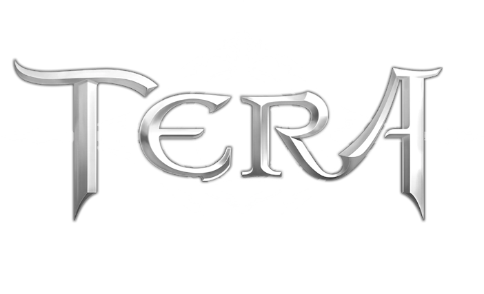

# TERA Arise Website

    

    <strong>
        The website of the TERA Arise organization hosted via GitHub Pages.
    </strong>

--------------------------------------------------------------------------------

This repository contains the source code for the TERA Arise organization
website, which is hosted at [tera-arise.io](https://tera-arise.io) via
[GitHub Pages](https://pages.github.com).

## Building

You will need the .NET SDK and Node.js installed. Simply run `./cake` (a
[Bash](https://www.gnu.org/software/bash) script) to build artifacts.

## License

This project is licensed under the terms found in
[`LICENSE-AGPL-3.0`](LICENSE-AGPL-3.0).
